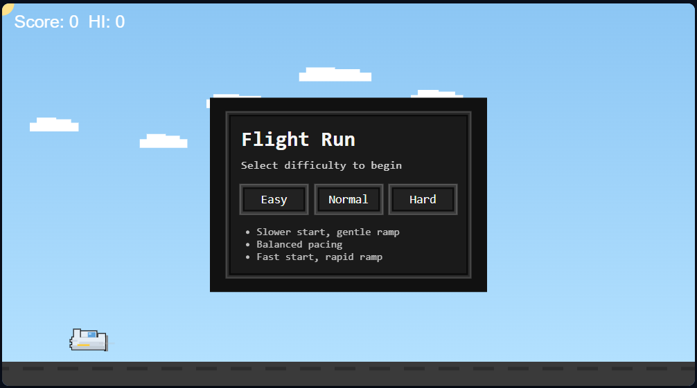
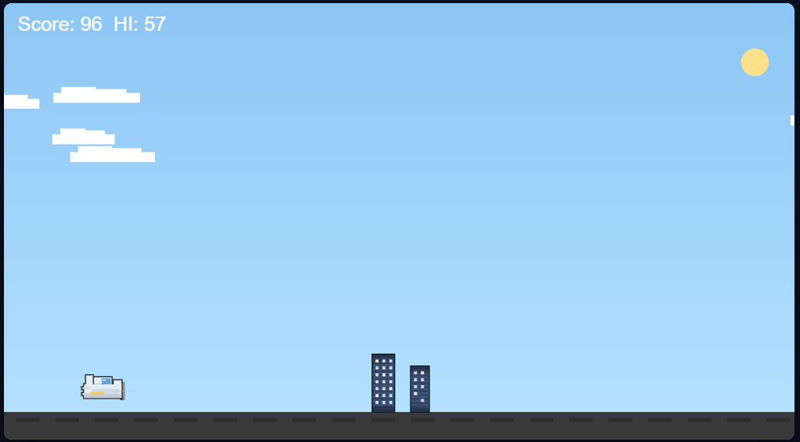
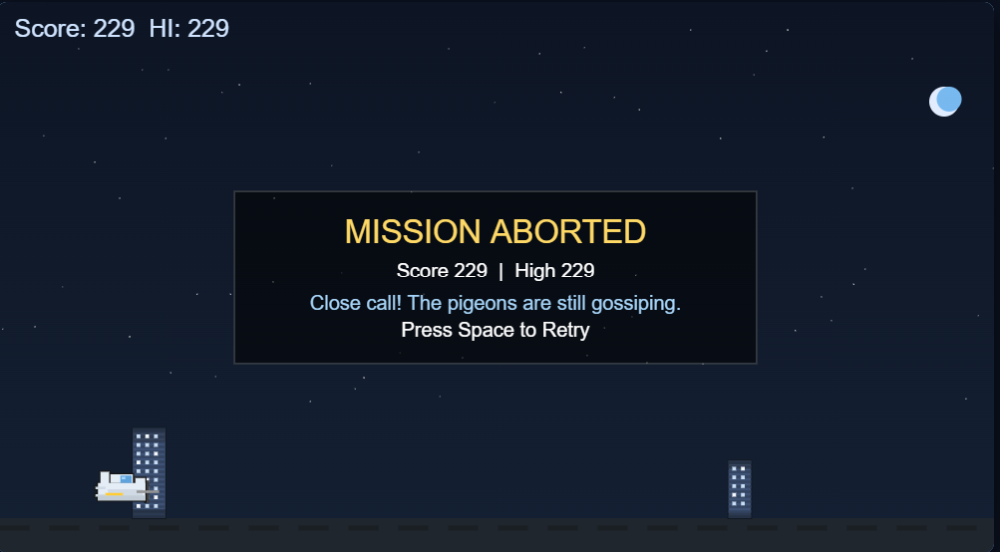

# Better Chrome Dino (Plane Runner)

A fast, pixel‑art endless runner built with Vite + TypeScript + Canvas 2D. Fly a tiny plane, dodge skyscrapers, and chase the night cycle.

## Features
- Pixel‑art visuals with crisp, integer‑snapped rendering
- Smooth day/night cycle with sun, moon, clouds, and stars
- Three difficulty modes (Easy, Normal, Hard)
- Distance‑based scoring with high score tracking
- Quick restart and keyboard/touch controls

## Tech stack
- Vite, TypeScript, Canvas 2D

## Project structure
```
index.html
package.json
tsconfig.json
public/
src/
  counter.ts
  main.ts
  game.ts
  style.css
  styles.css
```

## Controls
- Space or tap/click: Jump
- Start menu: pick difficulty (Easy/Normal/Hard)
- Restart button: top‑right overlay after first start

## Getting started
1) Install dependencies
2) Start the dev server
3) Open the local URL shown in your terminal

Example (npm):
- dev: `npm run dev`
- build: `npm run build`
- preview: `npm run preview`

## Screenshots
Images reside in `public/` so they can be served locally and also render directly on GitHub.

### Start Menu


### Daytime Gameplay


### Night Mode


> If images don’t appear on GitHub, ensure they were committed and paths are relative (no leading slash). For CDN hosting you can also reference raw URLs.

## Configuration notes
- Difficulty behavior: see `setPlaying()` and `setDifficulty()` in `src/game.ts`
- Day/night timing: see `dayLength`, `nightLength`, and `transitionDur` in `src/game.ts`
- Building spawn cadence: see `spawnObstacle()` and `spawnTimer` logic in `src/game.ts`

## Troubleshooting
- If sprites look blurry, ensure your browser zoom is 100% and `imageSmoothingEnabled` is disabled (set in `initEntities()`)
- If the canvas isn’t centered, check `styles.css` and that `index.html` has the expected structure

## Roadmap ideas
- Sound effects and minimal music toggle
- Pause/resume and mobile haptics
- Score milestones and subtle particle effects

## License
Add your license here (e.g., MIT). If you include third‑party assets, list them with attribution.
